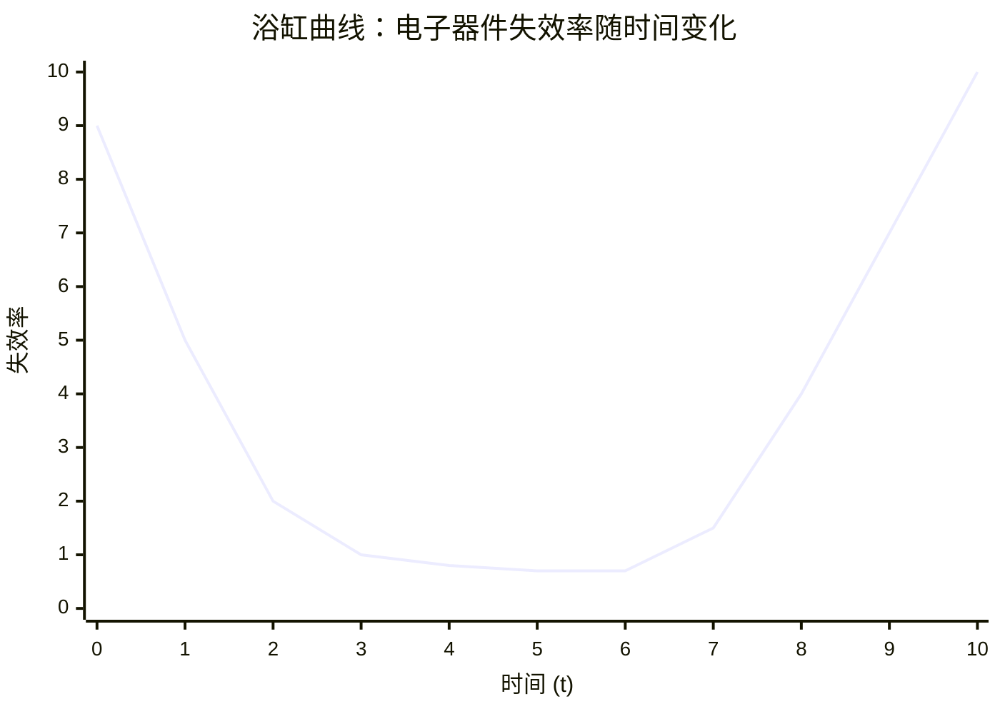
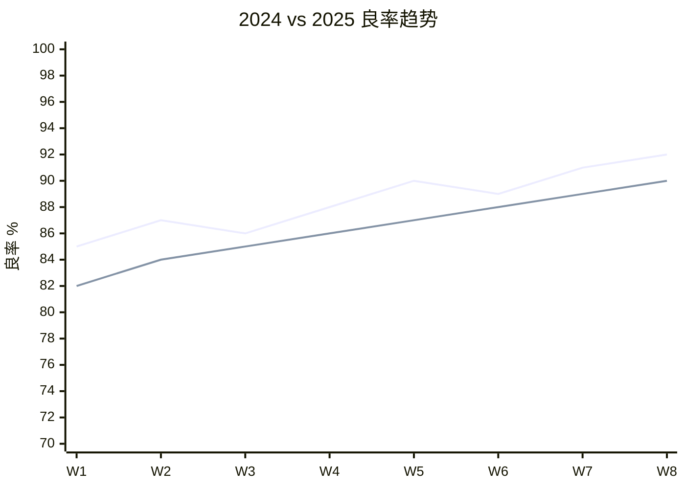
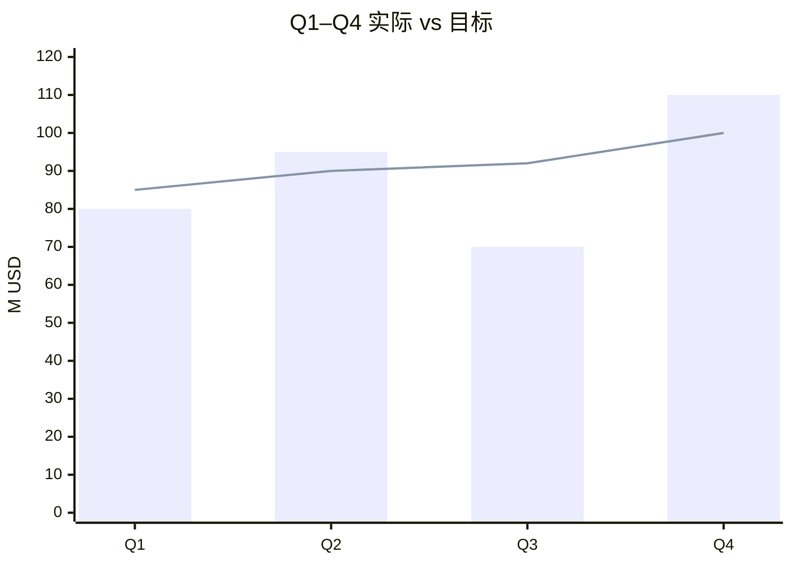

# Diagram Reference — Mermaid for inkwell

> Practical catalog of Mermaid diagram types that render correctly in the
> **inkwell** report skill. The skill uses `beautiful-mermaid` v1.1.3, which has
> a **stricter parser than the official Mermaid CLI**. This file is the single
> source of truth for "what works" and "what silently fails".
>
> For design tokens (colors, fonts, spacing) see `design-tokens.md`.
> For end-to-end skill workflow see `../SKILL.md`.

## 1. What Renders Reliably

| Diagram type | Block header | Status | Notes |
|---|---|---|---|
| Flowchart | `graph TD` / `graph LR` | ✅ Reliable | Use for architecture, pipelines, decision trees |
| Sequence | `sequenceDiagram` | ✅ Reliable | Use for time-ordered interactions |
| State | `stateDiagram-v2` | ✅ Reliable | Use for lifecycle, FSMs |
| Class | `classDiagram` | ✅ Reliable | Use for type / data-model relationships |
| ER | `erDiagram` | ✅ Reliable | Use for relational schemas |
| **XY chart** | `xychart-beta` | ⚠️ **Limited grammar** | See §3 below — most common source of bugs |
| Gantt | `gantt` | ❌ Not in beautiful-mermaid | Don't use |
| Pie | `pie` | ❌ Not in beautiful-mermaid | Don't use; build a `xychart-beta` bar instead |
| Mindmap | `mindmap` | ❌ Not in beautiful-mermaid | Don't use |
| Timeline | `timeline` | ❌ Not in beautiful-mermaid | Don't use |

## 2. Flowchart Conventions

```mermaid
graph LR
  A[Input] --> B{Decision}
  B -->|yes| C[Process]
  B -->|no|  D[End]
```

- Prefer `TD` for hierarchies, `LR` for pipelines.
- Node shapes: `[rect]`, `((circle))`, `[(cylinder)]`, `>asym]`, `{diamond}`.
- Edges: `-->`, `-.->` (dotted), `==>` (thick), `-->|label|text`.
- `subgraph` blocks nest cleanly; mind indentation.

## 3. XY Chart — Authoritative Grammar

`beautiful-mermaid` parses a **subset** of the Mermaid xychart grammar. Lines
that are not recognized are **silently dropped**, which means the chart can
render with axes and grid but no data — a frustrating failure mode.

### 3.1 Supported keywords (exact spelling)

```
xychart-beta [horizontal]
  title "..."
  x-axis "axis label" [cat1, cat2, ...]      OR   x-axis "label" 0 --> 10
  y-axis "axis label" 0 --> 10               OR   y-axis "label"
  line [v1, v2, v3, ...]                      (repeat for multi-series)
  bar  [v1, v2, v3, ...]                      (repeat for multi-series)
```

### 3.2 Silent failures — DO NOT use

| Construct | Why it fails | What to do instead |
|---|---|---|
| `line "My label" [1,2,3]` | The parser's regex is `^line\s+\[`, so the quoted label makes the **whole line drop** | Drop the label. Tooltips come for free on hover. |
| `bar  "My label" [1,2,3]` | Same as above | Drop the label. |
| `rect "Region" [x1, y1, x2, y2]` | `rect` is not a recognized keyword in beautiful-mermaid | Use a second `line` with constant values, or split into separate charts, or annotate with prose. |
| `-->` for axis range with no spaces | `0-->10` parses; `0 --> 10` is robust | Use spaces. |
| `xychart` (no `-beta`) | Some versions reject it | Always write `xychart-beta`. |

> **Heuristic for debugging**: if a `xychart-beta` block renders with axes and
> grid but no `line` / `bar` series, search the source for one of the
> unsupported constructs above. The first unrecognized line aborts the series
> list silently.

### 3.3 Numeric rules

- All values in a `line [...]` or `bar [...]` array **must parse as numbers**
  (`parseFloat`). Use `1.5`, `0.7`, `-3` — not `"1.5"`, not `"1,5"`, not `null`.
- The data length **must match** the x-axis category count, otherwise
  beautiful-mermaid falls back to range-mode (the categories you wrote are
  ignored and the x-axis becomes numeric).
- If you omit `y-axis "label" min --> max`, beautiful-mermaid auto-fits the
  range to the data with 10% padding. Specify a range when zero is meaningful
  (failure rates, error counts, percentages) so the visual baseline is honest.

## 4. XY Chart Templates

Each template below is **known to render** in beautiful-mermaid 1.1.3 with
the editorial theme (`--accent: #1B365D`, `--bg: #faf9f5`).

### 4.1 Single line — U / bath-tub / monotonic



> **Why this works**: no labels on `line`, no `rect`, range is explicit, all
> values are numeric, and the data count (11) matches the x-axis count (11).

### 4.2 Categorical x-axis (string labels)

```mermaid
xychart-beta
  title "Q1–Q4 营收对比"
  x-axis ["Q1", "Q2", "Q3", "Q4"]
  y-axis "营收 (M)" 0 --> 100
  line [42, 58, 71, 89]
```

> Use string categories for **discrete buckets** (quarters, regions,
> products). The parser accepts `["Q1","Q2","Q3","Q4"]` exactly.

### 4.3 Dual lines — comparison



> **Color warning**: the second line is auto-derived from the brand accent
> using HSL hue shift. With `#1B365D` (deep ink-blue) the second series lands
> in the green/teal range, which **breaks the single-ink-blue rule**. For
> editorial consistency, prefer a `bar` + `line` overlay (see 4.4) or split
> into two adjacent charts.

### 4.4 Bar + line overlay (best for "actuals + target")



> Bars get a 25% color-mix of the brand accent toward the parchment
> background, so they read as a softer "fill" while the line stays at full
> brand saturation. This is the **most editorial** multi-series shape.

### 4.5 Horizontal bars (rankings)

```mermaid
xychart-beta horizontal
  title "Top 5 风险项 (损失 M USD)"
  x-axis "损失" 0 --> 50
  y-axis "项目" ["供应链中断", "网络攻击", "合规", "人才流失", "汇率"]
  bar [42, 35, 22, 18, 12]
```

> `horizontal` swaps the roles. The categorical axis becomes the y-axis.
> **The y-axis must be a category list (strings), not a range** — beautiful-mermaid
> uses the y-axis parser only for category lists in horizontal mode.

### 4.6 Multiple bar series (grouped)

```mermaid
xychart-beta
  title "Region × Quarter"
  x-axis ["Q1", "Q2", "Q3", "Q4"]
  y-axis "Units" 0 --> 1000
  bar [200, 300, 250, 400]
  bar [150, 180, 220, 260]
  bar [100, 120, 130, 150]
```



> **Color warning**: same as 4.3. After the first bar (brand-tint), subsequent
> bars are HSL-shifted. If you must keep the brand ramp, you can override
> colors post-render in the generated HTML, or split into separate charts.

## 5. Quick Decision Tree

```
Need to show a trend over time?
  ├─ One series   →  xychart line (§4.1 or §4.2)
  ├─ Actuals + target   →  bar + line overlay (§4.4)
  ├─ Two comparable series  →  dual lines (§4.3)  ⚠ 2nd color drifts
  └─ Many groups   →  split into multiple charts OR grouped bars (§4.6) ⚠

Need to show discrete counts across categories?
  ├─ Vertical ranking   →  xychart bar (no horizontal flag)
  └─ Horizontal ranking  →  xychart horizontal (§4.5)

Need a process / architecture / pipeline?
  →  graph TD / graph LR  (§2)

Need a sequence of messages or state transitions?
  →  sequenceDiagram  /  stateDiagram-v2
```

## 6. Pre-flight Checklist (run before generating)

Open the JSON input, and for **every** `xychart-beta` block confirm:

- [ ] Header is `xychart-beta` (with the `-beta`)
- [ ] `line` and `bar` lines start with the keyword then `[` (no label)
- [ ] No `rect` keyword used
- [ ] All values in data arrays are bare numbers
- [ ] Data length matches x-axis category count (or x-axis is a numeric range)
- [ ] Y-axis range specified for percentage / failure-rate / count data
- [ ] Multi-series: aware that the 2nd+ color is HSL-shifted

The `verify-report.mjs` script performs a heuristic check (a `xychart-beta`
block that renders with axes but zero `xychart-line` paths is flagged as a
**silent failure**).
